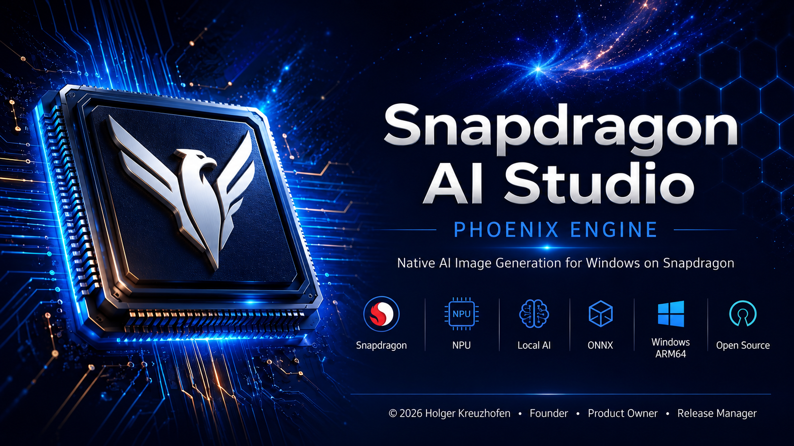
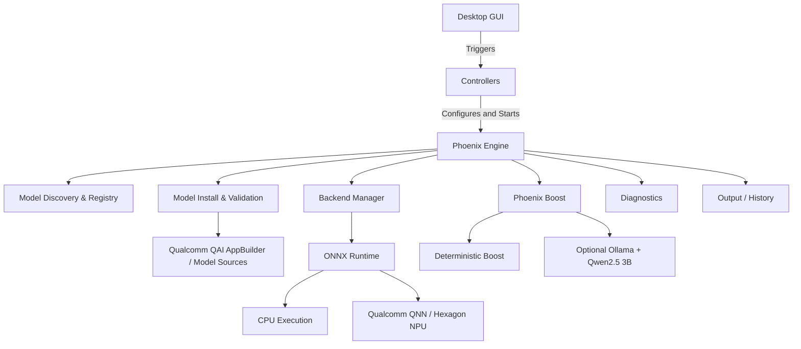

<a id="top"></a>

<p align="center">
  
</p>

> [!NOTE]
> **EN:** Independent open-source project for Windows on Snapdragon. Not an official Qualcomm product.
>
> **DE:** Unabhängiges Open-Source-Projekt für Windows auf Snapdragon. Kein offizielles Qualcomm-Produkt.
>
> **ES:** Proyecto independiente de código abierto para Windows en Snapdragon. No es un producto oficial de Qualcomm.

---

## 🛡️ Badges

<p align="center">
  <a href="https://github.com/Kreuzhofen/snapdragon-ai-studio/releases">
    
  </a>
  <a href="https://github.com/Kreuzhofen/snapdragon-ai-studio/blob/main/LICENSE">
    
  </a>
  <a href="https://github.com/Kreuzhofen/snapdragon-ai-studio/releases">
    
  </a>
  <a href="https://github.com/Kreuzhofen/snapdragon-ai-studio/stargazers">
    
  </a>
  <br>
  
  
  
  
</p>

---

## 📋 Table of Contents

- [About the Project](#-about-the-project)
- [RC2A — What Changed Since RC2](#-rc2a--what-changed-since-rc2)
- [Phoenix Boost](#-phoenix-boost)
- [Stable Diffusion 3.5 Medium](#-stable-diffusion-35-medium--qai-appbuilder)
- [Features](#-features)
- [Screenshots](#-screenshots)
- [Installation](#installation)
- [User Guides](#-user-guides--documentation)
- [System Requirements](#-system-requirements)
- [Quick Start](#quick-start)
- [Project Leadership](#-project-leadership)
- [Phoenix Engine](#-phoenix-engine)
- [Phoenix Architecture](#-phoenix-architecture)
- [Supported AI Backends](#supported-ai-backends)
- [Project Structure](#-project-structure)
- [Development](#development)
- [Testing](#-testing)
- [Diagnostics](#-diagnostics)
- [FAQ](#-faq)
- [Support](#-support)
- [License](#-license)
- [Trademark Notice](#trademark-notice)

---

## 📖 About the Project

**Snapdragon AI Studio – Phoenix Engine** is an independent open-source desktop application for local generative AI on Windows 11 ARM64 PCs.

It is built specifically around Snapdragon X hardware and aims to make local AI image generation approachable without forcing users to understand model package layouts, QNN components, ONNX files, or installation internals.

The product goal is deliberately simple:

> **Install Snapdragon AI Studio → select a model → generate an image.**

The **Phoenix Engine** coordinates model discovery, validation, installation, activation and inference while keeping supported generation workflows local on the PC.

---

## 🚀 RC2A — What Changed Since RC2

RC2A is a further stabilization and usability step on top of the major RC2 redesign. The focus is not simply on small bug fixes: the model download and installation workflow has been hardened further, **Phoenix Boost** has been refined, and the **Stable Diffusion 3.5 Medium / Qualcomm QAI AppBuilder** setup path has been substantially improved.

### 🔥 Phoenix Boost refined

**Phoenix Boost** is one of the core features developed for Snapdragon AI Studio.

RC2A continues to refine the prompt-enhancement workflow:

- deterministic local prompt enhancement,
- optional local **AI Boost**,
- **Ollama + Qwen2.5 3B** integration,
- prompt preview before generation,
- local processing after setup,
- graceful fallback: Phoenix Boost remains optional and never needs to block normal image generation.

Phoenix Boost is designed to help turn a short idea into a richer image prompt while keeping the user in control of the final text.

### 📥 Download & installation reliability

RC2A further improves the guided model-installation workflow introduced with RC2:

- clearer download, preparation, validation and activation phases,
- improved handling of existing installation data,
- distinction between complete and incomplete model sources,
- explicit redownload paths when a source is incomplete or damaged,
- stronger validation before a model is treated as ready,
- automatic activation after a successful installation,
- less technical decision-making for the user.

The intended user experience is no longer “find the right files and put them in the right folder.” Phoenix guides the process.

### 🧠 Stable Diffusion 3.5 Medium / QAI AppBuilder

The largest RC2A installation improvement is the **Stable Diffusion 3.5 Medium** setup path built around Qualcomm **QAI AppBuilder**.

Phoenix now guides and automates the workflow as far as possible:

1. locate the expected QAI AppBuilder ZIP,
2. extract and prepare the Qualcomm workspace,
3. prepare the required setup dependencies,
4. run the Qualcomm SD3.5 workflow,
5. download the required model data,
6. import the resulting model into Snapdragon AI Studio,
7. create validation/manifest information,
8. validate the final installation,
9. activate the model.

RC2A also hardens workspace reuse. Phoenix checks whether an existing extracted workspace actually belongs to the currently selected ZIP. Stale or mismatched extraction data can be replaced instead of silently being reused.

The current Qualcomm model download is approximately **3.24 GB**.

### ✅ Real clean-install validation

The RC2A SD3.5 path has been validated through the complete real user flow:

> **not installed → first-attempt setup → Qualcomm download → import → validation → activation → real image generation**

This is an important milestone for the RC2A workflow: installation is not considered complete merely because files exist — the model must validate and successfully reach the actual generation path.

### 🧭 Guided first-run experience

RC2A continues the RC2 goal of making the application understandable to non-technical users:

- clearer first-run readiness state,
- beginner-friendly Model Manager,
- guided model sources,
- automatic post-install activation,
- clearer status and progress feedback,
- direct transition from setup to image generation.

---

## 🔥 Phoenix Boost

Phoenix Boost improves or expands prompts before image generation.

### Deterministic Boost

The deterministic mode works locally without an additional language model. It enhances prompts through reproducible rules and remains available independently of Ollama.

### Phoenix AI Boost

The optional AI-powered mode uses:

- **Ollama** as the local model service
- **Qwen2.5 3B** as the local language model

Once installed, prompt enhancement runs locally. Phoenix shows the enhanced prompt before generation so the user can see what will be sent to the image pipeline.

> Phoenix Boost is optional. A missing Ollama or Qwen installation must not prevent normal image generation.

---

## 🧠 Stable Diffusion 3.5 Medium — QAI AppBuilder

RC2A introduces a substantially more automated path for Stable Diffusion 3.5 Medium.

Instead of asking the user to manually assemble individual technical model components, Phoenix coordinates the QAI AppBuilder preparation, model download, import, validation and activation.

The installation UI reports the current stage throughout the process. Complete existing data can be reused where appropriate, while incomplete or stale data is detected rather than accepted as a finished installation.

This workflow was successfully validated from a clean “not installed” state through a real generated image.

---

## ⚡ Features

| Feature Group | Component | RC2A Status | Description |
|---|---|---:|---|
| **Platform** | Native Windows ARM64 | ✅ Supported | Designed for Windows 11 ARM64. |
| **Hardware** | Snapdragon X Plus / X Elite | ✅ Primary target | Optimized around Windows on Snapdragon systems. |
| **Inference** | Qualcomm QNN / Hexagon NPU | ✅ Integrated | Local accelerated execution for compatible model pipelines. |
| **Inference** | ONNX Runtime | ✅ Integrated | Local runtime foundation used by supported pipelines. |
| **Models** | Stable Diffusion 1.5 | ✅ Available | Guided model workflow with supported Qualcomm/NPU package path. |
| **Models** | Stable Diffusion 2.1 | ✅ Available | Guided Snapdragon/Qualcomm-oriented model workflow. |
| **Models** | Stable Diffusion 3.5 Medium | ✅ RC2A validated | Guided QAI AppBuilder setup and real generation path validated. |
| **Models** | SDXL and additional models | 🧪 Experimental | Continued research and development. |
| **Prompting** | Phoenix Boost | ✅ Supported | Deterministic boost plus optional local AI Boost. |
| **Prompting** | Ollama + Qwen2.5 3B | ✅ Optional | Local AI-powered prompt enhancement. |
| **Control** | ControlNet Canny | ✅ Supported where compatible | Structural image guidance for supported model/backend combinations. |
| **UX** | Guided First Run | ✅ Improved | Clearer path from first launch to first image. |
| **Management** | Model Manager | ✅ Improved | Guided installation, validation and activation. |
| **Localization** | EN / DE / ES | ✅ Supported | English, German and Spanish interface. |
| **Privacy** | Local generation | ✅ Core design | Supported generation runs locally after required setup/downloads. |

---

## 📸 Screenshots

### Main Workspace

<p align="center">
  
</p>

### AI Image Generation

<p align="center">
  
</p>

### Model Management

<p align="center">
  
</p>

### Image Comparison

<p align="center">
  
</p>

### Gallery

<p align="center">
  
</p>

### Settings

<p align="center">
  
</p>

---

## Installation

### Option A: Release Installer — Recommended

1. Open the Snapdragon AI Studio **Releases** page.
2. Download `SnapdragonAIStudio-2.0.0-rc.2a-ARM64-Setup.exe`.
3. Run the installer and follow the Windows setup wizard.
4. Start Snapdragon AI Studio from the Start menu or shortcut.
5. Use the guided Model Manager to set up your first model.

A separate Python installation is not required for normal use of the published installer.

### Option B: Development / Source

Development from source requires an appropriate Windows ARM64 development environment and Python 3.11 ARM64.

```powershell
git clone https://github.com/Kreuzhofen/snapdragon-ai-studio.git
cd snapdragon-ai-studio

py -3.11-arm64 -m venv .venv
.\.venv\Scripts\Activate.ps1

python -m pip install --upgrade pip
python -m pip install -r requirements.txt

python gui_v2.py
```

---

## 📚 User Guides / Documentation

RC2A includes dedicated user documentation in three languages:

- 🇩🇪 **Deutsch:** [Benutzerhandbuch](docs/user-guide/USER_GUIDE_DE.md)
- 🇬🇧 **English:** [User Guide](docs/user-guide/USER_GUIDE_EN.md)
- 🇪🇸 **Español:** [Manual de usuario](docs/user-guide/USER_GUIDE_ES.md)

The user guides cover first-run setup, model installation, Stable Diffusion 3.5 Medium, Phoenix Boost, ControlNet Canny, local data, privacy and troubleshooting.

---

## 💻 System Requirements

| Requirement | Minimum / Target |
|---|---|
| **Operating System** | Windows 11 ARM64 |
| **Processor** | Snapdragon X Plus / Snapdragon X Elite |
| **Memory** | Model-dependent; 16 GB or more recommended |
| **Storage** | Application plus sufficient SSD space for selected models |
| **Internet** | Required for initial application/model/component downloads |
| **Runtime** | Bundled/managed by the published application where applicable |

Large models require additional disk space. Stable Diffusion 3.5 Medium downloads approximately 3.24 GB of Qualcomm model data during setup, plus temporary/setup files.

---

## Quick Start

1. Launch **Snapdragon AI Studio**.
2. Check the readiness status on the home page.
3. Open the **Model Manager**.
4. Select an available model.
5. Follow the guided installation if the model is not yet installed.
6. Wait for validation and activation.
7. Open image generation.
8. Enter a prompt.
9. Optionally use **Phoenix Boost**.
10. Click **Generate**.

No manual selection of individual QNN/ONNX model components is required for the normal guided workflow.

---

## 👥 Project Leadership

### Holger Kreuzhofen
*Founder • Lead Developer • Product Owner • Phoenix Engine Architect*

Holger Kreuzhofen is the founder and lead developer of Snapdragon AI Studio and the architect of the Phoenix Engine. He is responsible for the product vision, software architecture, engineering direction, user experience and release management of the independent open-source project.

---

## 🌐 Phoenix Engine

The **Phoenix Engine** is the orchestration layer behind Snapdragon AI Studio.

Its responsibilities include:

- model discovery and registry,
- productive installation-path resolution,
- package/source validation,
- model installation and activation,
- backend selection,
- prompt processing,
- inference orchestration,
- diagnostics and progress reporting,
- output handling.

RC2/RC2A increasingly move technical setup complexity behind this orchestration layer so users can focus on selecting a model and creating images.

---

## 🎨 Phoenix Architecture



The diagram is intentionally high-level. Individual model pipelines can use different runtime and preparation paths.

---

## Supported AI Backends

| Backend / Path | Target | RC2A Status | Notes |
|---|---|---:|---|
| **ONNX Runtime CPU** | Snapdragon CPU | ✅ Supported | Local compatibility and validation path where supported. |
| **Qualcomm QNN** | Hexagon NPU | ✅ Integrated | Hardware-accelerated execution for compatible QNN model pipelines. |
| **Qualcomm QAI AppBuilder** | Qualcomm model workflow | ✅ SD3.5 path validated | Used by the guided Stable Diffusion 3.5 Medium setup path. |
| **Additional backends / models** | Model-dependent | 🧪 Experimental | Research continues without presenting experimental paths as production-ready. |

---

## 📁 Project Structure

```text
snapdragon-ai-studio/
├── app/                  # Application bootstrap/core
├── assets/               # Branding, icons and visual assets
├── controllers/          # Workflow and UI orchestration
├── data/                 # Local application data/metadata
├── dialogs/              # Dialog windows
├── docs/                 # Project and user documentation
│   └── user-guide/       # RC2A user guides (DE / EN / ES)
├── engine/               # Phoenix Engine and inference/install services
├── installer/            # Windows installer configuration
├── locales/              # EN / DE / ES localization
├── models/               # Development model area
├── tests/                # Automated tests
├── tools/                # Setup/support utilities, including SD3.5 setup
├── widgets/              # Phoenix UI widgets/views
├── gui_v2.py             # Main development GUI entry point
├── requirements.txt      # Development dependencies
└── version.py            # Version information
```

Installed release builds can use user-local application/model directories rather than the repository paths shown above.

---

## Development

External contributions are welcome. Please read [CONTRIBUTING.md](CONTRIBUTING.md) and the project development documentation before making substantial changes.

Core principles include:

- keep UI and inference responsibilities separated,
- preserve Windows ARM64 compatibility,
- validate model/install state rather than trusting stale metadata,
- update tests when behavior changes,
- keep EN/DE/ES localization in sync,
- avoid breaking already validated model workflows.

---

## 🧪 Testing

The project uses automated tests together with real-device validation.

For development:

```powershell
python -m pytest
```

For release-critical model workflows, automated tests alone are not sufficient. RC2A development also uses real Windows-on-Snapdragon user-flow tests, including clean model installation and actual image generation.

---

## 🔍 Diagnostics

Snapdragon AI Studio includes diagnostic and progress reporting intended to make local AI workflows understandable and debuggable.

Depending on the active model/backend, diagnostics can expose:

- model and productive path resolution,
- package/source validation state,
- active runtime/backend information,
- installation and activation phases,
- generation progress,
- pipeline timing and error information,
- log output for reproducible troubleshooting.

RC2A places particular emphasis on validating the real model state instead of relying only on previously stored installation metadata.

---

## ❓ FAQ

### Is Snapdragon AI Studio an official Qualcomm product?

No. It is an independent open-source project and is not affiliated with, sponsored by, or endorsed by Qualcomm Technologies, Inc.

### Which processors are the primary target?

Snapdragon X Plus and Snapdragon X Elite on Windows 11 ARM64.

### Do I need an internet connection?

Initial application/model/component downloads require internet access. After successful setup, supported image generation runs locally and does not require a cloud image-generation service.

### Do I need Python?

Not for normal use of the published Windows installer. Python 3.11 ARM64 is primarily relevant for development and source execution.

### Do I need Ollama?

Only for the optional **Phoenix AI Boost**. Normal image generation and deterministic Phoenix Boost do not depend on Ollama.

### Which model does Phoenix AI Boost use?

RC2A uses **Qwen2.5 3B** through Ollama.

### How is Stable Diffusion 3.5 Medium installed?

RC2A provides a guided Qualcomm QAI AppBuilder workflow that prepares the source, runs the Qualcomm setup, downloads the required model data, imports it into Snapdragon AI Studio, validates it and activates it.

### Is SD3.5 actually tested beyond installation?

Yes. The RC2A flow was validated from a clean not-installed state through successful setup, model validation/activation and a real generated image.

### Which interface languages are available?

English, German and Spanish.

---

## 🤝 Contributing

Contributions are welcome.

1. Fork the repository.
2. Create a focused feature branch.
3. Follow the project architecture and coding guidelines.
4. Add/update tests where appropriate.
5. Update documentation when behavior changes.
6. Open a pull request with a clear description and relevant diagnostics.

See [CONTRIBUTING.md](CONTRIBUTING.md) and [CODE_OF_CONDUCT.md](CODE_OF_CONDUCT.md).

---

## 🔒 Security

Please do not disclose security vulnerabilities publicly. Follow [SECURITY.md](SECURITY.md) for responsible reporting.

---

## 💬 Support

- **Bug reports:** [GitHub Issues](https://github.com/Kreuzhofen/snapdragon-ai-studio/issues)
- **Feature requests:** [GitHub Issues](https://github.com/Kreuzhofen/snapdragon-ai-studio/issues) / [Discussions](https://github.com/Kreuzhofen/snapdragon-ai-studio/discussions)
- **Questions and setup help:** [GitHub Discussions](https://github.com/Kreuzhofen/snapdragon-ai-studio/discussions)

When reporting issues, never publish access tokens, credentials or other confidential information.

---

## 📄 License

Distributed under the MIT License. See [LICENSE](LICENSE) for details.

---

## 💖 Acknowledgements

Thanks to the developers and communities behind:

- ONNX Runtime
- Qualcomm AI software and QAI AppBuilder
- Python
- Hugging Face
- Stability AI
- Ollama
- Qwen

---

## Trademark Notice

Qualcomm, Snapdragon and Hexagon are trademarks or registered trademarks of Qualcomm Incorporated. Windows is a trademark of Microsoft. ONNX is a trademark of The Linux Foundation. Other trademarks belong to their respective owners.

Use of these names describes technical platforms, compatibility or third-party components and does not imply an official partnership or product affiliation.

---

<p align="center">
  <strong>Snapdragon AI Studio — Phoenix Engine</strong><br>
  <em>Local AI image generation for Windows 11 ARM64.</em>
</p>

<p align="center">
  <strong>Holger Kreuzhofen</strong><br>
  Founder • Lead Developer • Product Owner • Phoenix Engine Architect
</p>

<p align="right">
  <a href="#top">Back to top</a>
</p>
