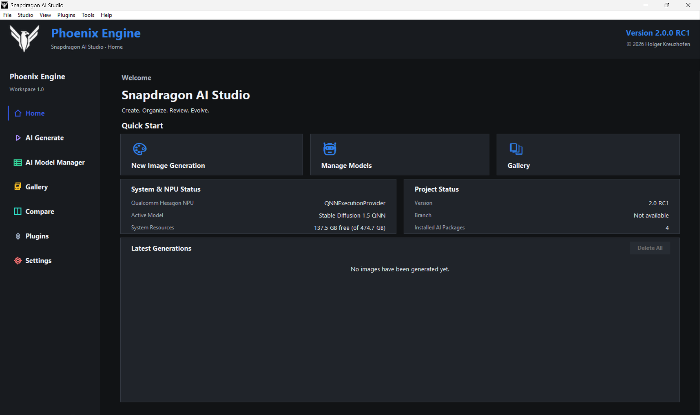
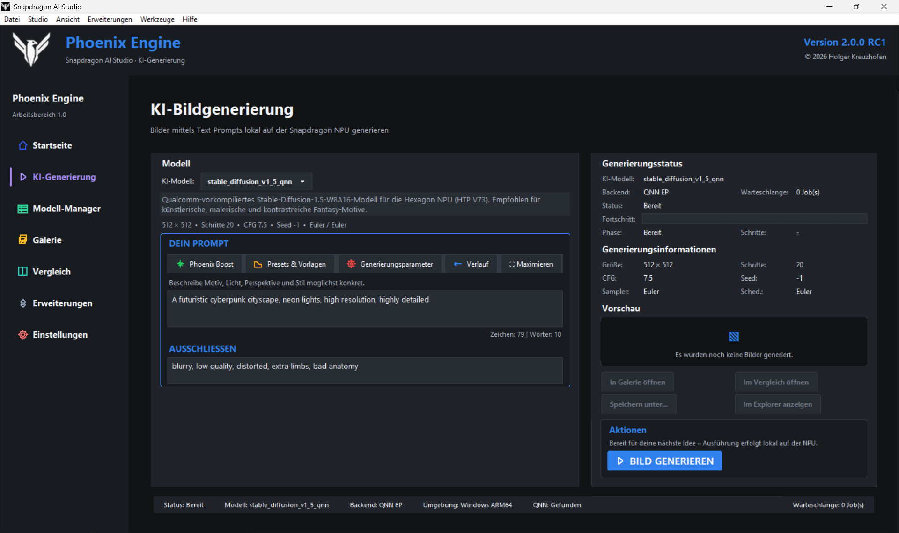
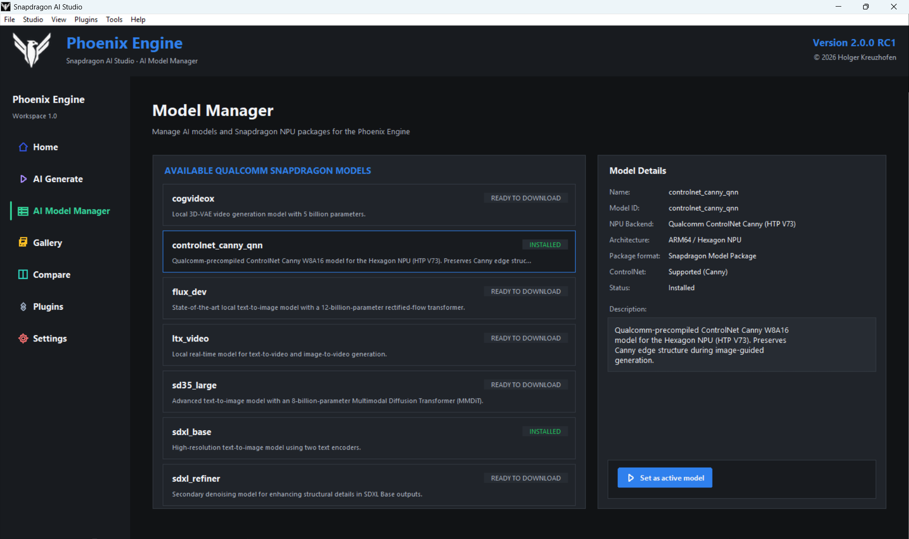
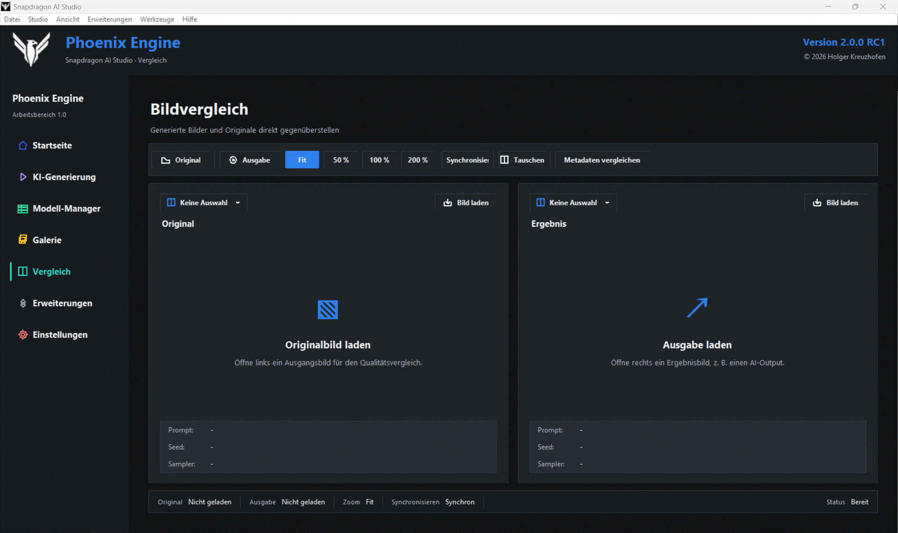
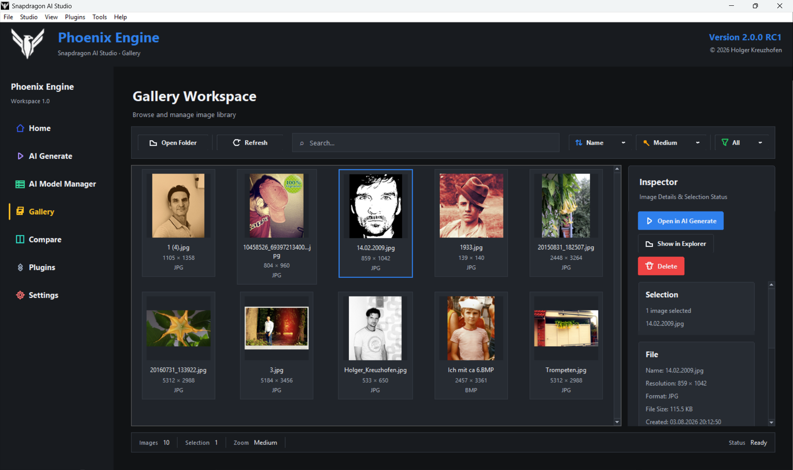
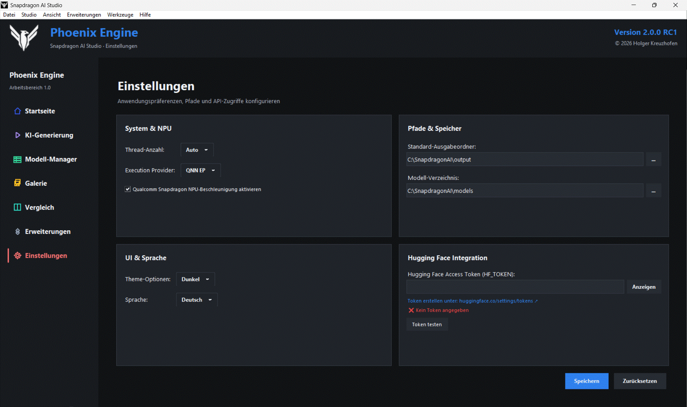
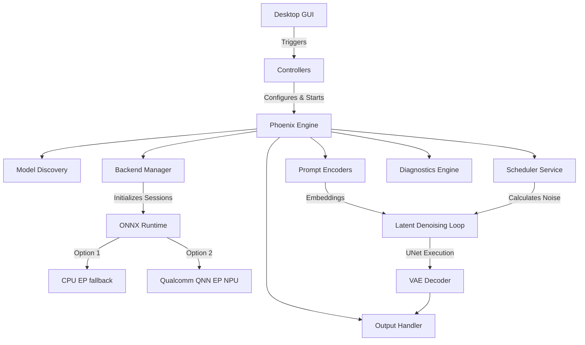

<a id="top"></a>

<h1 align="center">
  <span style="display: inline-block; vertical-align: middle; margin-right: 16px;"><picture><source media="(prefers-color-scheme: dark)" srcset="assets/brand/phoenix_logo_white.png"><source media="(prefers-color-scheme: light)" srcset="assets/brand/phoenix_logo_black.png"></picture></span><span style="display: inline-block; vertical-align: middle;">Snapdragon AI Studio</span>
</h1>

<p align="center">
  <strong style="vertical-align: middle;">Professional Local Generative AI Desktop Environment</strong><br>
  <em>Engineered for Windows 11 ARM64 and Qualcomm Snapdragon X Series hardware. Optimized with the Phoenix Engine, ONNX Runtime, and Qualcomm QNN.</em>
</p>

---

## 🛡️ Badges

<p align="center">
  <a href="https://github.com/Kreuzhofen/snapdragon-ai-studio/releases">
    
  </a>
  <a href="https://github.com/Kreuzhofen/snapdragon-ai-studio/blob/main/LICENSE">
    
  </a>
  <a href="https://github.com/Kreuzhofen/snapdragon-ai-studio/releases">
    
  </a>
  <a href="https://github.com/Kreuzhofen/snapdragon-ai-studio/stargazers">
    
  </a>
  <br>
  <a href="#system-requirements">
    
  </a>
  <a href="#system-requirements">
    
  </a>
  <a href="#supported-ai-backends">
    
  </a>
  <a href="#supported-ai-backends">
    
  </a>
  <br>
  <a href="#installation">
    
  </a>
  <a href="#rc1-status">
    
  </a>
  <a href="https://github.com/Kreuzhofen/snapdragon-ai-studio/issues">
    
  </a>
  <a href="https://github.com/Kreuzhofen/snapdragon-ai-studio/blob/main/CONTRIBUTING.md">
    
  </a>
</p>

---

## 📋 Table of Contents

- [About the Project](#about-the-project)
- [Why Snapdragon AI Studio?](#why-snapdragon-ai-studio)
- [Project Leadership](#project-leadership)
- [Phoenix Engine](#phoenix-engine)
- [Features](#features)
- [Screenshots](#screenshots)
- [Installation](#installation)
- [System Requirements](#system-requirements)
- [Quick Start](#quick-start)
- [Phoenix Architecture](#phoenix-architecture)
- [Supported AI Backends](#supported-ai-backends)
- [Project Structure](#project-structure)
- [Development](#development)
- [Testing](#testing)
- [Diagnostics](#diagnostics)
- [RC1 Status](#rc1-status)
- [RC2 Roadmap](#rc2-roadmap)
- [FAQ](#faq)
- [Contributing](#contributing)
- [Security](#security)
- [Support](#support)
- [License](#license)
- [Acknowledgements](#acknowledgements)
- [Trademark Notice](#trademark-notice)

---

## 📖 About the Project

Snapdragon AI Studio is an independent, open-source desktop application designed to execute generative AI models locally on Windows 11 ARM64 PCs. Built from the ground up for modern ARM64 System-on-Chips (SoCs), it enables high-performance, private, and secure Stable Diffusion image generation directly on Snapdragon X Elite and X Plus hardware.

At its core, the application leverages the **Phoenix Engine**—a decoupled, modular inference architecture that interfaces with ONNX Runtime and the Qualcomm QNN Execution Provider. By keeping all computations local, the studio ensures maximum privacy, eliminates cloud subscription costs, and operates fully offline.

---

## 💡 Why Snapdragon AI Studio?

- **Windows on ARM Native**: Designed natively for ARM64 Windows PCs rather than wrapping x64 binaries.
- **Qualcomm Hardware Acceleration**: Direct utilization of Qualcomm Snapdragon X NPU cores through the Qualcomm AI Stack and QNN.
- **Privacy First**: All prompts, configurations, and generated images remain entirely on your local drive.
- **Transparent Diagnostics**: Provides deep runtime insight into NPU compatibility, active execution providers, and performance metrics.
- **Deterministic Workflows**: Predictable generation outcomes through advanced seed controls and scheduler management.

---

## 👥 Project Leadership

### Holger Kreuzhofen
*Founder • Lead Developer • Product Owner • Phoenix Engine Architect*

Holger is the founder, lead developer, product owner, and Phoenix Engine architect of Snapdragon AI Studio. As the creator of Snapdragon AI Studio and the Phoenix Engine, he is responsible for the overall product vision, software architecture, engineering strategy, user experience design, release management, and long-term development. Under his direction, the project bridges the gap between Windows on ARM systems and native local AI execution runtimes.

---

## 🌀 Phoenix Engine

The **Phoenix Engine** is the orchestration layer driving Snapdragon AI Studio. It separates UI presentation from execution pipelines:

- **Modular Architecture**: Clean Model-View-Controller separation; views trigger commands without executing blocking model loops.
- **Model Discovery & Registry**: Automatically scans, registers, and validates local ONNX model directories.
- **Scheduler Service**: Integrates Euler, DPM-Solver, and DDIM schedulers for precise noise estimation.
- **Pipeline Orchestration**: Handles text encoding, classifier-free guidance, UNet loops, and VAE decoding.
- **Backend Abstraction**: Manages dynamic session instantiation for various Execution Providers (EPs).
- **Diagnostics Tracing**: Emits granular telemetry on memory usage, graph operators, and load times.

---

## ⚡ Features

| Feature Group | Component | Status | Description |
|---------------|-----------|--------|-------------|
| **Platform** | Native Windows ARM64 | 🟢 Supported | Fully compiled ARM64 binaries for Windows 11. |
| **Inference** | Qualcomm QNN EP | 🟢 Integrated | Hardware-accelerated NPU execution via QNN stack. |
| **Inference** | ONNX Runtime CPU | 🟢 Supported | Dependable CPU execution provider for baseline runs. |
| **Inference** | Dynamic Backend Switching | 🟢 Supported | Hot-swap between CPU and NPU runtimes without restarting. |
| **AI Models** | Stable Diffusion v1.5 | 🟢 Supported | Native execution of SD 1.5 pipelines. |
| **AI Models** | SDXL Ready | 🟡 Experimental | Support for Stable Diffusion XL pipelines in progress. |
| **Diagnostics** | Environment Tracing | 🟢 Supported | Real-time discovery of installed runtimes and libraries. |
| **Diagnostics** | Real-Time Logging | 🟢 Supported | UI-integrated logging terminal and file exports. |
| **Extensibility** | Plugin Framework | 🟢 Supported | Dynamic loading of custom models, schedulers, and pipelines. |
| **UX/UI** | Fluent UI Layout | 🟢 Supported | Modern, dark-mode optimized Windows 11 interface. |
| **UX/UI** | Theme Manager | 🟢 Supported | Full parity between Light and Dark themes with zero glitches. |
| **UX/UI** | Multi-Language Support | 🟢 Supported | Localization for English, German, and Spanish. |
| **Management** | Model Registry | 🟢 Supported | Interactive UI for configuring and validating local models. |
| **Management** | Prompt Management | 🟢 Supported | Dedicated workspace for positive, negative prompts and presets. |
| **Inference** | NPU Optimizations | 🟡 In Development | Custom graph partitioning and quantization maps. |

---

## 📸 Screenshots

### Main Workspace

<p align="center">
  
</p>

### AI Image Generation

<p align="center">
  
</p>

### Model Management

<p align="center">
  
</p>

### Image Comparison

<p align="center">
  
</p>

### Gallery

<p align="center">
  
</p>

### Settings

<p align="center">
  
</p>

---

## ⚙️ Installation

### Option A: Install via Release Package (Recommended)

1. Navigate to [Snapdragon AI Studio Releases](https://github.com/Kreuzhofen/snapdragon-ai-studio/releases).
2. Download the latest installer: `SnapdragonAIStudio-2.0.0-rc.1-ARM64-Setup.exe`.
3. Launch the installer and follow the Windows setup wizard.
4. Run the application from your Start Menu or Desktop shortcut.

### Option B: Build and Run from Source

Ensure Python 3.11 (ARM64) is installed on your Windows ARM64 PC.

```powershell
# 1. Clone the repository
git clone https://github.com/Kreuzhofen/snapdragon-ai-studio.git
cd snapdragon-ai-studio

# 2. Configure the native ARM64 virtual environment
py -3.11-arm64 -m venv .venv
.\.venv\Scripts\Activate.ps1

# 3. Upgrade pip and install all required dependencies
python -m pip install --upgrade pip
python -m pip install -r requirements.txt

# 4. Launch the application GUI
python gui_v2.py
```

---

## 💻 System Requirements

| Requirement | Minimum Specifications | Recommended Specifications |
|-------------|------------------------|----------------------------|
| **Operating System** | Windows 11 ARM64 (Build 22621 or higher) | Windows 11 ARM64 (Latest Update) |
| **Processor** | Snapdragon X Plus (10 Cores) | Snapdragon X Elite (12 Cores) |
| **System Memory** | 16 GB LPDDR5x | 32 GB LPDDR5x |
| **Storage** | 5 GB for application + model space | 50 GB fast NVMe SSD for models |
| **Qualcomm Drivers** | Snapdragon CPU/GPU Drivers (v31.0.38.0) | Latest Qualcomm NPU Drivers (v31.0.82.0+) |
| **AI Runtime** | ONNX Runtime 1.19.0 | ONNX Runtime 1.20.0+ |

---

## ⏱️ Quick Start

1. Launch **Snapdragon AI Studio**.
2. Navigate to **Settings** and verify your NPU status in the Diagnostics tab.
3. Select an ONNX model from the model list (ensure folders match `models/` directory structure).
4. Enter your positive prompt (e.g., *"A futuristic city in the style of cyberpunk, 8k resolution, highly detailed"*) and negative prompt.
5. Choose your backend: Select **Qualcomm QNN** for NPU hardware acceleration, or **CPU** as a compatible fallback.
6. Click **Generate** and track the progress via the progress bar and real-time logs.
7. View and save your generated image directly from the output history.

---

## 🎨 Phoenix Architecture



---

## 🗃️ Supported AI Backends

| Backend Provider | Execution Target | RC1 Status | Performance Notes |
|------------------|------------------|------------|-------------------|
| **ONNX Runtime CPU EP** | Snapdragon CPU cores | 🟢 Supported | Slower execution; serves as a deterministic debug fallback. |
| **Qualcomm QNN EP** | Hexagon NPU | 🟢 Integrated | High-speed local NPU inference; requires compiled model graphs. |
| **DirectML** | Adreno GPU | 🟡 Planned | Future GPU acceleration path targeted for RC2. |

---

## 📁 Project Structure

```text
snapdragon-ai-studio/
├── app/                  # Application Core Bootstrapper
├── assets/               # Branding assets, icons, and logos
├── controllers/          # Model-View-Controller orchestration
├── data/                 # Local workspace data and metadata
├── dialogs/              # Modals and settings dialog UI components
├── docs/                 # Documentation and design charters
├── engine/               # Phoenix Engine core pipeline services
├── gui/                  # Primary UI views and widgets
├── installer/            # Setup compilation files
├── locales/              # Translation files (EN, DE, ES)
├── models/               # Local cache for downloaded ONNX models
├── tests/                # Unit and integration test suites
├── widgets/              # Reusable UI widgets
├── gui_v2.py             # Main entry point for local GUI execution
├── phoenix.py            # CLI entry point for Phoenix Engine
├── requirements.txt      # Python dependencies list
└── version.py            # Software version registry
```

---

## 🛠️ Development

We welcome external contributions. Please align with the following standards:

### Branching Model

- Release branches host production-ready release candidate tag commits (e.g. `v2.0.0-rc1`).
- Active development occurs on development branches. Feature branches must diverge from and merge back into the main development branch.

### Coding Guidelines

- **PEP 8**: Strict adherence to standard Python formatting rules.
- **Architectural Isolation**: UI components (`gui/`) must never contain inference calculations; delegate all workload tasks to `engine/` via `controllers/`.
- **Theme Support**: Every UI change must be verified against both Light and Dark themes via `ThemeManager`.

### Pull Request Rules

- Target your PRs to the active development branch.
- Ensure all automated unit tests pass.
- Write descriptive commits using Conventional Commits.

---

## 🧪 Testing

Snapdragon AI Studio uses `pytest` for validation:

```powershell
# Run the complete test suite
python -m pytest

# Run with verbose output
python -m pytest -v
```

Before submitting modifications, check:
1. All unit tests compile successfully.
2. `py_compile` checks pass across modified scripts.
3. UI remains visually sound in English, German, and Spanish.

---

## 🔍 Diagnostics

A core strength of Snapdragon AI Studio is its diagnostic pipeline. Instead of failing silently, the studio reports NPU environment state:
- **Provider Detection**: Scans and logs all execution providers registered with ONNX Runtime.
- **Session Verification**: Reports tensor sizes and mismatched inputs during runtime compilation.
- **Performance Logs**: Profiles execution times for text encoding, UNet loops, and VAE decoding.
- **Crash Diagnostics**: Automatically writes dump reports to `logs/` to simplify bug investigations.

---

## 📈 RC1 Status

| Parameter | Scope | Status | Validation Result |
|-----------|-------|--------|-------------------|
| **Installer** | Setup creation | 🟢 Complete | Generates clean installer packages on ARM64. |
| **Localization** | Multi-language UI | 🟢 Complete | Full support for EN, DE, and ES translations. |
| **CPU Pipeline** | ONNX fallback | 🟢 Verified | Validated stable generation. |
| **NPU Pipeline** | Qualcomm QNN EP | 🟡 Testing | NPU acceleration operational with compatible QNN-compiled models. |
| **UI Aesthetics** | Commercial Polish | 🟢 Complete | Smooth layouts, fluid theme switching, high-quality styles. |

---

## 🗺️ RC2 Roadmap

| Milestone | Target | Description | Progress |
|-----------|--------|-------------|----------|
| **SDXL Optimization** | NPU Execution | Optimize SDXL layers to fit NPU memory profiles. | ⏳ Planned |
| **QNN Quantization** | FP16/INT8 Compilation | Provide tools to compile and quantize models directly on device. | 🔄 In Progress |
| **DirectML Integration** | Adreno GPU Support | Add DirectML backend as an alternative local acceleration path. | ⏳ Planned |
| **Custom Schedulers** | Pipeline Extension | Integrate UniPC and LCM schedulers. | ⏳ Planned |
| **Benchmark Tool** | NPU performance tests | Add NPU benchmark utility to measure steps per second. | 🔄 In Progress |

---

## ❓ FAQ

### 1. Is Snapdragon AI Studio an official Qualcomm product?
No. It is an independent open-source project and is not affiliated with, sponsored by, or endorsed by Qualcomm Technologies, Inc.

### 2. Which processors are supported?
Qualcomm Snapdragon X Elite and Snapdragon X Plus are the primary target platforms for this project. While other Windows 11 ARM64 Snapdragon devices may run the application, they are not officially validated, and compatibility or performance may vary.

### 3. Can I run this tool on Intel or AMD Windows PCs?
Snapdragon AI Studio is designed specifically for Windows 11 ARM64. On Intel or AMD systems, some components may run in CPU-only mode, while others may not be compatible because of ARM64-specific dependencies. x64 platforms are not officially supported or optimized.

### 4. Do I need an internet connection to generate images?
No. Once the application is installed and your models are placed in the `models/` folder, the generation runs fully local and offline.

### 5. Why is NPU generation failing with my ONNX model?
QNN requires highly specific operator layouts and quantization (usually FP16 or INT8). Standard ONNX models intended for CPU/GPU may contain operators that are not supported by the Hexagon NPU.

### 6. Where can I get NPU-optimized models?
NPU-compatible models can be compiled using the Qualcomm AI Engine SDK or sourced from community projects that explicitly support Qualcomm QNN.

### 7. Does Snapdragon AI Studio support Stable Diffusion XL (SDXL)?
SDXL support is currently experimental. Additional Qualcomm QNN optimizations are planned for future releases, including RC2.

### 8. What is the role of the Phoenix Engine?
The Phoenix Engine manages the core execution steps: parsing prompts, latent denoising, scheduler computations, and model execution via ONNX Runtime providers.

### 9. How do I switch between NPU and CPU execution?
Use the dropdown list under "Execution Provider" in the main workspace view to switch. The backend will reinitialize on your next generation.

### 10. Does the application support custom seeds?
Yes. You can input specific seeds for deterministic outputs or leave the seed field at `-1` to generate random images.

### 11. What languages are available in the user interface?
Currently, English, German, and Spanish are fully supported. You can change your language in the Settings dialog.

### 12. Where are the generated images saved?
By default, images are saved to the `output/` directory in your installation folder, which can be configured inside Settings.

### 13. Which Python version is required?
Python 3.11 ARM64 is recommended for developers building Snapdragon AI Studio from source. The published installer release does not require a separate Python installation.

### 14. What scheduling algorithms are supported?
We currently support Euler, Euler Ancestral, DPM-Solver, and DDIM. More schedulers are planned for the RC2 release.

### 15. Why does CPU generation take a long time?
CPU execution serves primarily for compatibility, development, and validation. Qualcomm QNN offers significantly higher performance, provided the specific model and operators are supported by the Hexagon NPU.

### 16. How can I resolve SmartScreen warnings during installation?
The RC1 installer is currently self-signed. You can bypass the warning by clicking "More info" and selecting "Run anyway" if downloaded from our official repository.

### 17. How do I contribute model profiles or translations?
Please check our `CONTRIBUTING.md` guidelines, format your file changes, and submit a Pull Request to our target project branch.

### 18. Where are application settings stored?
Configurations are stored locally. The exact storage location may vary depending on the installation method and future updates.

### 19. Does the studio support plugin packages?
Snapdragon AI Studio features an extensible plugin architecture. Documented extension points are detailed in the developer documentation.

### 20. Who owns the copyright of the generated images?
Legally, copyright ownership of generated images depends on local jurisdictions and intellectual property laws. Since Snapdragon AI Studio operates entirely offline, no cloud provider claims ownership or licensing rights over your creations. However, users must comply with the specific model license terms (such as the CreativeML Open RAIL-M license for Stable Diffusion) that apply to the weights used for generation.

---

## 🤝 Contributing

We welcome contributions to Snapdragon AI Studio. To ensure high standards, please follow our collaborative workflow:

1. **Fork the repository.**
2. **Create a feature branch:** `git checkout -b feature/descriptive-name`
3. **Follow the coding standards.**
4. **Add or update tests where appropriate.**
5. **Update the documentation when behavior changes.**
6. **Open a pull request** with a clear description and relevant diagnostics.
7. **Participate in code review.**
8. **Follow the [Code of Conduct](CODE_OF_CONDUCT.md).**

Please read our [CONTRIBUTING.md](CONTRIBUTING.md) and adhere to the [Code of Conduct](CODE_OF_CONDUCT.md).

---

## 🔒 Security

We take security seriously. If you discover a vulnerability, please do not disclose it publicly. Follow our security policy guidelines in [SECURITY.md](SECURITY.md) to report bugs and security issues privately.

---

## 💬 Support

If you run into issues:
- **Bug Reports** — Open a [GitHub Issue](https://github.com/Kreuzhofen/snapdragon-ai-studio/issues) using the provided issue template.
- **Feature Requests** — Open a feature request or start a [GitHub Discussion](https://github.com/Kreuzhofen/snapdragon-ai-studio/discussions).
- **Community Support** — Use [GitHub Discussions](https://github.com/Kreuzhofen/snapdragon-ai-studio/discussions) for questions, setup help, and shared solutions.

---

## 📄 License

Distributed under the MIT License. See [LICENSE](https://github.com/Kreuzhofen/snapdragon-ai-studio/blob/main/LICENSE) for details.

---

## 💖 Acknowledgements

We thank the developers of the following tools and frameworks:
- **ONNX Runtime**: The foundational backend execution provider.
- **Qualcomm Technologies, Inc.**: For NPU drivers and AI Engine specifications.
- **Python Software Foundation**: For the ARM64 Python ecosystem.
- **Hugging Face**: For advancing the open AI ecosystem.
- **Stability AI**: For the Stable Diffusion model family.

---

## ⚠️ Trademark Notice

Qualcomm, Snapdragon, and Hexagon are trademarks or registered trademarks of Qualcomm Incorporated. Windows is a registered trademark of Microsoft Corporation. ONNX is a trademark of The Linux Foundation. All other trademarks belong to their respective owners.

---

<p align="center">
  <strong>Snapdragon AI Studio</strong><br>
  <em>Native AI Image Generation for Windows 11 ARM64 powered by Qualcomm Snapdragon, ONNX Runtime and the Phoenix Engine.</em>
</p>

<p align="right">
  <a href="#top">Back to top</a>
</p>
