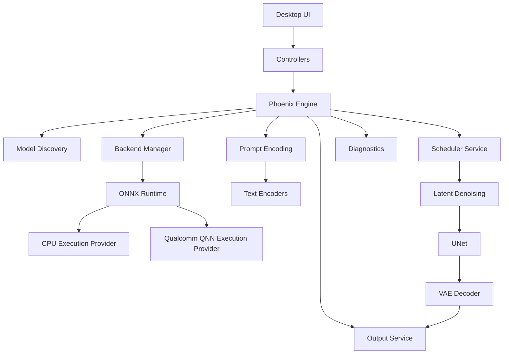

<div align="center">

# Snapdragon AI Studio

### Local AI image generation for Snapdragon AI PCs

**A Windows 11 ARM64 desktop studio powered by the Phoenix Engine, ONNX Runtime, and Qualcomm QNN.**

[](https://github.com/Kreuzhofen/snapdragon-ai-studio/releases)
[](#system-requirements)
[](#development-setup)
[](#supported-ai-backends)
[](#qualcomm-qnn)
[](#project-status)

[Download RC1](https://github.com/Kreuzhofen/snapdragon-ai-studio/releases/tag/v2.0.0-rc1)
&nbsp;·&nbsp;
[Report a Bug](https://github.com/Kreuzhofen/snapdragon-ai-studio/issues/new?template=bug_report.md)
&nbsp;·&nbsp;
[Request a Feature](https://github.com/Kreuzhofen/snapdragon-ai-studio/issues/new?template=feature_request.md)
&nbsp;·&nbsp;
[Contribute](CONTRIBUTING.md)

</div>

---

## Overview

Snapdragon AI Studio is an independent desktop application for local AI image
generation on Windows on ARM.

It is designed for Snapdragon AI PCs and combines a native desktop workflow with
a modular inference architecture called the **Phoenix Engine**.

The project focuses on four goals:

1. Make local generative AI approachable on Windows ARM64.
2. Provide transparent backend selection and diagnostics.
3. Support ONNX Runtime CPU execution as a dependable baseline.
4. Investigate and expand Qualcomm QNN and Snapdragon NPU acceleration.

Snapdragon AI Studio is currently available as **version 2.0 RC1**.

RC1 is feature-frozen and published for validation, feedback, compatibility
testing, and preparation for RC2.

> [!IMPORTANT]
> Snapdragon AI Studio 2.0 RC1 is a release candidate.
> It is not yet the final stable 2.0 release.

---

## Table of Contents

- [Why Snapdragon AI Studio?](#why-snapdragon-ai-studio)
- [Highlights](#highlights)
- [Features](#features)
- [Screenshots](#screenshots)
- [Installation](#installation)
- [System Requirements](#system-requirements)
- [Quick Start](#quick-start)
- [Phoenix Architecture](#phoenix-architecture)
- [Supported AI Backends](#supported-ai-backends)
- [Model and Pipeline Notes](#model-and-pipeline-notes)
- [Diagnostics](#diagnostics)
- [Project Status](#project-status)
- [RC2 Roadmap](#rc2-roadmap)
- [Project Structure](#project-structure)
- [Development Setup](#development-setup)
- [Testing](#testing)
- [Contributing](#contributing)
- [Security](#security)
- [Support](#support)
- [FAQ](#faq)
- [License](#license)
- [Acknowledgements](#acknowledgements)
- [Trademark Notice](#trademark-notice)

---

## Why Snapdragon AI Studio?

Most local image-generation tools were created around x64 desktop systems and
discrete GPUs.

Snapdragon AI Studio explores a different path: a dedicated local AI experience
for modern Windows ARM64 devices.

### Windows ARM64 first

The application is built around Windows 11 on ARM rather than treating ARM64 as
an afterthought.

The release workflow, installer, runtime discovery, diagnostics, and backend
selection are all designed with ARM64 systems in mind.

### Local by design

Prompts, model execution, diagnostics, and generated images remain on the local
computer unless the user explicitly moves or shares them.

No cloud inference service is required for the core generation workflow.

### Transparent execution

The application exposes the active model, execution provider, progress,
diagnostic channels, and errors instead of hiding the inference process behind a
single opaque button.

### Modular architecture

The Phoenix Engine separates the user interface from model discovery, prompt
encoding, scheduling, inference, decoding, diagnostics, and output handling.

This reduces coupling and gives future backends a stable integration point.

### Snapdragon-focused research

Qualcomm QNN support remains a central project direction.

CPU execution provides a practical compatibility and validation path, while QNN
and Snapdragon NPU work continue as a major technical focus for RC2 and beyond.

---

## Highlights

| Area | Snapdragon AI Studio 2.0 RC1 |
|---|---|
| Primary platform | Windows 11 ARM64 |
| Target hardware | Snapdragon AI PCs |
| Application type | Native desktop studio |
| Core architecture | Phoenix Engine |
| Inference runtime | ONNX Runtime |
| CPU execution | Supported |
| Qualcomm QNN | Integrated and hardware-dependent |
| Local generation | Yes |
| Diagnostics | Built in |
| Themes | Light and dark |
| Localization | Multilingual user interface |
| Distribution | ARM64 installer and source |
| Release channel | Pre-release / RC1 |

---

## Features

### AI generation workspace

- Prompt and negative-prompt input
- Configurable image dimensions
- Seed control
- Inference-step configuration
- Guidance-scale configuration
- Scheduler selection
- Model selection
- Backend selection
- Generation progress
- Output preview
- Generated-image history

### Phoenix Engine

- Model discovery
- Backend abstraction
- ONNX session management
- Prompt encoding
- Scheduler integration
- Latent initialization
- UNet execution
- Classifier-free guidance
- VAE decoding
- Output persistence
- Structured diagnostics

### Desktop experience

- Native Windows workflow
- Light and dark themes
- Settings management
- Localized interface
- Navigation workspaces
- Recent generations
- Image comparison tools
- Integrated log and diagnostic views
- Installer-based distribution

### Engineering and validation

- Automated test suite
- Reproducible seed support
- Backend capability checks
- Model-path diagnostics
- Runtime-provider reporting
- Failure reporting without silent mock output
- Source-based development workflow
- Release metadata and versioning

---

## Screenshots

The RC1 repository is ready for product screenshots.

Recommended screenshot locations are:

```text
docs/images/home.png
docs/images/generate.png
docs/images/compare.png
docs/images/settings.png
docs/images/diagnostics.png
```

Once these files are added, this section can be replaced with a compact gallery:

```html
<p align="center">
  
  
</p>
```

> [!NOTE]
> No broken screenshot links are embedded in RC1.
> Product screenshots will be added as part of the repository presentation work.

---

## Installation

### Option A — Install the RC1 build

1. Open the
   [Snapdragon AI Studio 2.0 RC1 release](https://github.com/Kreuzhofen/snapdragon-ai-studio/releases/tag/v2.0.0-rc1).
2. Expand **Assets**.
3. Download:

```text
SnapdragonAIStudio-2.0.0-rc.1-ARM64-Setup.exe
```

4. Run the installer.
5. Follow the installation wizard.
6. Start Snapdragon AI Studio from the installed shortcut.

> [!WARNING]
> The RC1 installer is not code-signed.
> Windows may display a Microsoft Defender SmartScreen warning.
> Verify that the installer was downloaded from this repository before running it.

### Option B — Run from source

Clone the repository:

```powershell
git clone https://github.com/Kreuzhofen/snapdragon-ai-studio.git
cd snapdragon-ai-studio
```

Create and activate an ARM64 virtual environment:

```powershell
py -3.11-arm64 -m venv .venv
.\.venv\Scripts\Activate.ps1
```

Install the Python dependencies:

```powershell
python -m pip install --upgrade pip
python -m pip install -r requirements.txt
```

Launch the primary interface:

```powershell
python gui_v2.py
```

---

## System Requirements

### Installed application

| Component | Minimum | Recommended |
|---|---:|---:|
| Operating system | Windows 11 | Current Windows 11 |
| Architecture | ARM64 | ARM64 |
| Processor | Windows ARM64 device | Snapdragon X Series |
| Memory | 16 GB | 32 GB |
| Free storage | 5 GB plus models | 20 GB or more |
| Display | 1280 × 720 | 1920 × 1080 or higher |
| AI runtime | Bundled / detected runtime | Current compatible runtime |

### Source development

| Component | Requirement |
|---|---|
| Python | Python 3.11 ARM64 |
| Git | Current Git for Windows |
| PowerShell | Windows PowerShell or PowerShell 7 |
| Package manager | `pip` |
| Test runner | `pytest` |
| Primary entry point | `gui_v2.py` |

### Qualcomm QNN

QNN execution depends on more than the application itself.

A working QNN configuration may require:

- Compatible Snapdragon hardware
- Compatible Windows drivers
- A supported Qualcomm AI Stack installation
- A compatible ONNX Runtime QNN Execution Provider
- Models exported for the expected QNN configuration
- Sufficient device memory
- Supported graph operators and tensor layouts

Backend availability does not guarantee that every model can execute on every
device.

---

## Quick Start

### Installed RC1

1. Start **Snapdragon AI Studio**.
2. Open the generation workspace.
3. Select an available model.
4. Select the intended execution backend.
5. Enter a prompt.
6. Review width, height, steps, guidance scale, and seed.
7. Start generation.
8. Follow progress in the interface.
9. Review the output and diagnostics.
10. Save or open the generated image in Explorer.

### Source checkout

```powershell
cd C:\SnapdragonAI
python gui_v2.py
```

### Recommended first validation

For an initial compatibility check:

- Use a known local ONNX model.
- Start with the CPU Execution Provider.
- Use a fixed seed.
- Keep the initial resolution moderate.
- Review diagnostics before changing providers.
- Test QNN only after the CPU path and model discovery are confirmed.

---

## Phoenix Architecture

The Phoenix Engine is the orchestration layer behind Snapdragon AI Studio.



### Architectural layers

#### User interface

The UI owns presentation, navigation, settings, user input, progress display,
and result presentation.

It does not need to know the internal implementation of every inference backend.

#### Controllers

Controllers translate user actions into application operations.

They coordinate workspace state without embedding the complete inference
pipeline in UI code.

#### Phoenix Engine

The Phoenix Engine orchestrates generation jobs.

It validates configuration, resolves models, initializes services, selects an
execution provider, executes the pipeline, and reports progress and failures.

#### Services

Dedicated services handle individual responsibilities such as text embeddings,
UNet execution, scheduling, image decoding, persistence, and diagnostics.

#### Backend layer

The backend layer maps model execution to ONNX Runtime providers.

This creates a common path for CPU validation and QNN acceleration while keeping
provider-specific behavior isolated.

---

## Supported AI Backends

| Backend | RC1 status | Primary purpose | Notes |
|---|---|---|---|
| ONNX Runtime CPU EP | Supported | Compatibility and validation | High memory use and slower generation are expected |
| Qualcomm QNN EP | Integrated | Snapdragon acceleration | Device, runtime, model, and graph compatibility required |
| Additional providers | Planned | Future expansion | Not part of the frozen RC1 scope |

### ONNX Runtime CPU

The CPU Execution Provider is the most broadly compatible execution path in
RC1.

It is especially useful for:

- Model discovery validation
- Pipeline debugging
- Deterministic comparisons
- Provider-independent diagnostics
- Reference runs when QNN is unavailable

CPU-based diffusion can be slow and memory intensive on large models.

### Qualcomm QNN

The QNN Execution Provider is the project's Snapdragon-focused acceleration
path.

The application can detect and use QNN when the runtime is correctly installed
and the selected model is compatible.

QNN support should be understood as an active engineering area rather than a
promise that every ONNX diffusion model will run unchanged on the NPU.

### Backend selection philosophy

Snapdragon AI Studio does not silently pretend that an unavailable backend is
working.

The selected provider, detected providers, model path, session creation, and
pipeline failures are exposed through diagnostics so that execution can be
verified.

---

## Model and Pipeline Notes

Snapdragon AI Studio works with local ONNX model components.

A diffusion pipeline may include:

```text
model/
├── tokenizer/
├── tokenizer_2/
├── text_encoder/
├── text_encoder_2/
├── unet/
├── vae_encoder/
├── vae_decoder/
└── scheduler/
```

Exact requirements depend on the selected model and export.

### Compatibility is model-specific

Two models with similar names may behave differently because of:

- Different ONNX exports
- Custom operators
- Embedded execution-provider contexts
- Static or dynamic tensor shapes
- Quantization formats
- Unsupported operators
- Different text-encoder outputs
- Scheduler assumptions
- VAE scaling or output conventions

### Models are not bundled by default

Large AI model files may have separate licenses and distribution terms.

Users are responsible for obtaining models from legitimate sources and
complying with the applicable model licenses.

---

## Diagnostics

Diagnostics are a core feature, not an afterthought.

Typical diagnostic channels include:

```text
CPU PIPELINE
TEXT ENCODER 1
TEXT ENCODER 2
UNET
DENOISE
VAE
WATCHDOG
PROGRESS
MODEL PATH
```

Useful information includes:

- Detected ONNX Runtime providers
- Selected execution provider
- Model root and component paths
- Session initialization
- Input and output tensor shapes
- Scheduler state
- Denoising progress
- Runtime errors
- Output path
- Job duration
- Memory-related failures

When opening a bug report, include the relevant diagnostic output whenever
possible.

Do not include private prompts, personal file paths, or other sensitive data
unless required and intentionally shared.

---

## Project Status

### Current release

```text
Version: 2.0.0 RC1
Tag:     v2.0.0-rc1
Branch:  main
State:   Feature-frozen release candidate
```

### RC1 status

- Public repository available
- ARM64 installer published
- Release tag published
- Source archives published by GitHub
- Core feature set frozen
- Documentation and community files available
- Bug reports and compatibility feedback accepted
- No new RC1 features planned

### What RC1 means

RC1 is a candidate for the future stable 2.0 release.

It is suitable for evaluation and testing, but users should expect limitations,
especially around model compatibility, image quality, runtime performance, and
QNN execution.

### Known RC1 limitations

- Image quality still requires substantial validation and improvement.
- Large diffusion pipelines can consume significant memory.
- CPU inference can be slow.
- QNN support depends on the full hardware and software stack.
- Some ONNX graphs are tied to specific execution contexts.
- Not every model export is interchangeable.
- The installer is not code-signed.
- Linux and macOS are not supported.
- Product screenshots and extended tutorials are still being prepared.

---

## RC2 Roadmap

RC2 will prioritize technical quality over feature expansion.

### Image-quality validation

- Establish trusted reference outputs
- Compare identical prompts, seeds, and parameters
- Validate text-encoder output
- Validate pooled embeddings and hidden states
- Verify scheduler behavior
- Inspect latent evolution
- Compare UNet outputs
- Validate VAE scaling and decoding
- Improve semantic image quality

### Snapdragon and QNN

- Expand QNN compatibility testing
- Improve provider diagnostics
- Investigate graph partitioning
- Investigate load-on-demand execution
- Evaluate memory-aware model loading
- Investigate SDXL feasibility on Snapdragon NPU
- Compare QNN and CPU output consistency
- Document supported hardware and runtime combinations

### Performance

- Reduce unnecessary model initialization
- Improve session reuse
- Reduce duplicate tensor transfers
- Optimize classifier-free guidance execution
- Improve progress reporting
- Measure memory use
- Define reproducible benchmarks

### User experience

- Improve model compatibility messages
- Improve setup and onboarding
- Refine generation controls
- Review image comparison value
- Improve recent-generation management
- Continue localization and accessibility work
- Add real product screenshots and examples

### Documentation

- Publish tested model guidance
- Add backend troubleshooting
- Add QNN setup documentation
- Add architecture details
- Add reproducible quality-test procedures
- Add developer contribution examples

> [!NOTE]
> The roadmap describes intended work and may change as technical findings,
> hardware constraints, and community feedback evolve.

---

## Project Structure

The repository is organized by responsibility:

```text
snapdragon-ai-studio/
├── .github/
│   └── ISSUE_TEMPLATE/
├── app/
├── assets/
│   └── brand/
├── controllers/
├── data/
├── dialogs/
├── docs/
├── engine/
├── gui/
├── installer/
├── locales/
├── models/
├── modules/
├── pages/
├── plugins/
├── presets/
├── resources/
├── scripts/
├── tests/
├── tools/
├── widgets/
├── workflows/
├── gui_v2.py
├── phoenix.py
├── requirements.txt
├── requirements-build.txt
├── pytest.ini
├── release.json
└── version.py
```

### Important entry points

| Path | Purpose |
|---|---|
| `gui_v2.py` | Primary development launch entry |
| `phoenix.py` | Phoenix orchestration entry |
| `engine/` | Inference and pipeline services |
| `controllers/` | UI-to-application coordination |
| `pages/` | Main workspaces |
| `widgets/` | Reusable UI components |
| `locales/` | Localization resources |
| `tests/` | Automated validation |
| `installer/` | Windows installer sources |
| `release.json` | Release metadata |
| `version.py` | Application version information |

---

## Development Setup

### 1. Clone

```powershell
git clone https://github.com/Kreuzhofen/snapdragon-ai-studio.git
cd snapdragon-ai-studio
```

### 2. Create an environment

```powershell
py -3.11-arm64 -m venv .venv
.\.venv\Scripts\Activate.ps1
```

If script execution is blocked for the current PowerShell session:

```powershell
Set-ExecutionPolicy -Scope Process -ExecutionPolicy Bypass
.\.venv\Scripts\Activate.ps1
```

### 3. Install dependencies

```powershell
python -m pip install --upgrade pip
python -m pip install -r requirements.txt
```

### 4. Launch

```powershell
python gui_v2.py
```

### 5. Verify the environment

```powershell
python --version
python -c "import platform; print(platform.machine())"
python -c "import onnxruntime as ort; print(ort.get_available_providers())"
```

Expected architecture:

```text
ARM64
```

Provider output depends on the installed runtime.

---

## Testing

Run the configured test suite from the repository root:

```powershell
python -m pytest
```

For more detailed output:

```powershell
python -m pytest -v
```

Before submitting a pull request:

1. Run relevant tests.
2. Confirm the application starts.
3. Verify that model discovery still works.
4. Check both light and dark themes for UI changes.
5. Check localization-sensitive UI changes.
6. Include diagnostics for inference changes.
7. Avoid committing models, generated images, logs, or temporary build output.

---

## Contributing

Contributions are welcome.

Read [CONTRIBUTING.md](CONTRIBUTING.md) before opening a pull request.

A productive contribution usually starts with a focused issue describing:

- The problem
- The affected version
- The device and Windows version
- The selected backend
- The model or pipeline
- Reproduction steps
- Expected behavior
- Actual behavior
- Relevant diagnostics

Keep pull requests focused and avoid unrelated refactoring.

For major architecture or backend work, open an issue before implementation so
that scope and compatibility can be discussed.

All participants are expected to follow the
[Code of Conduct](CODE_OF_CONDUCT.md).

---

## Security

Please do not publish unreviewed security vulnerabilities in a public issue.

Follow the instructions in [SECURITY.md](SECURITY.md).

A useful report includes:

- A clear description
- Reproduction steps
- Affected versions
- Potential impact
- Suggested mitigation, when available

---

## Support

Start with the following resources:

1. This README
2. [SUPPORT.md](SUPPORT.md)
3. Existing [GitHub Issues](https://github.com/Kreuzhofen/snapdragon-ai-studio/issues)
4. The diagnostic output produced by the application

Use the bug-report template for reproducible defects.

Use the feature-request template for proposed improvements.

Please remember that RC1 is maintained as an independent open-source project and
does not include commercial support guarantees.

---

## FAQ

### Is Snapdragon AI Studio an official Qualcomm product?

No.

It is an independent project and is not affiliated with, sponsored by, or
endorsed by Qualcomm.

### Does it run on x64 Windows PCs?

The primary supported target for RC1 is Windows 11 ARM64.

Other architectures are outside the published RC1 support scope.

### Does it run on Linux or macOS?

No.

RC1 targets Windows 11 ARM64.

### Does it require an internet connection?

The core inference workflow is local.

Internet access may still be needed to obtain the installer, source code,
dependencies, updates, or separately licensed models.

### Are models included?

Large model packages are not assumed to be bundled with the repository.

Model availability and licensing depend on the selected pipeline.

### Is CPU generation supported?

Yes.

ONNX Runtime CPU execution is the baseline compatibility path, although large
diffusion models can be slow and memory intensive.

### Is the Snapdragon NPU supported?

Qualcomm QNN integration is present, but successful NPU execution depends on
hardware, drivers, runtime versions, graph compatibility, model export, and
memory constraints.

### Does QNN automatically make every model faster?

No.

A model must be compatible with the provider, and performance depends on graph
partitioning, supported operators, quantization, tensor transfers, and device
characteristics.

### Why can a model load on CPU but fail on QNN?

CPU and QNN providers support different operator sets, graph structures, memory
limits, and export assumptions.

A model that is valid ONNX is not automatically valid for every execution
provider.

### Why is CPU generation slow?

Diffusion pipelines repeatedly execute large neural networks.

Runtime depends on model size, image resolution, number of steps, memory
bandwidth, provider optimization, and system load.

### Is RC1 production-ready?

RC1 is a public release candidate for testing and feedback.

It is not the final stable 2.0 release.

### Where should bugs be reported?

Use the
[Bug Report template](https://github.com/Kreuzhofen/snapdragon-ai-studio/issues/new?template=bug_report.md).

### Where should features be proposed?

Use the
[Feature Request template](https://github.com/Kreuzhofen/snapdragon-ai-studio/issues/new?template=feature_request.md).

### How can I help?

Useful contributions include:

- Reproducible compatibility reports
- Windows ARM64 testing
- QNN diagnostics
- ONNX model-export research
- Image-quality comparisons
- Documentation
- Localization
- Focused bug fixes
- Test coverage

---

## Release History

See [CHANGELOG.md](CHANGELOG.md) for notable project changes.

Current public release:

- [Snapdragon AI Studio 2.0 RC1](https://github.com/Kreuzhofen/snapdragon-ai-studio/releases/tag/v2.0.0-rc1)

---

## License

This repository currently does not contain a root `LICENSE` file.

Until an explicit license is added, copyright law applies by default and no
general permission to copy, modify, or redistribute the source code should be
assumed.

A formal open-source license should be selected and added before the stable 2.0
release.

---

## Acknowledgements

Snapdragon AI Studio builds on the work of many projects and communities,
including:

- ONNX Runtime and its contributors
- The ONNX ecosystem
- Python and its contributors
- The Windows on Arm developer community
- Qualcomm AI Stack and QNN documentation
- Stable Diffusion and diffusion-model research communities
- Open-source localization, testing, packaging, and UI tooling
- Everyone testing local AI workloads on Snapdragon hardware

Thank you to every user who reports reproducible issues, shares diagnostics,
tests model exports, improves documentation, or contributes code.

---

## Trademark Notice

Qualcomm and Snapdragon are trademarks or registered trademarks of Qualcomm
Incorporated.

Windows is a trademark of the Microsoft group of companies.

ONNX is a trademark of the Linux Foundation.

All other product names, trademarks, and registered trademarks are the property
of their respective owners.

Use of these names is descriptive and does not imply affiliation, sponsorship,
or endorsement.

---

<div align="center">

**Snapdragon AI Studio**

*Local AI. Windows ARM64. Phoenix Engine.*

[Back to top](#snapdragon-ai-studio)

</div>
